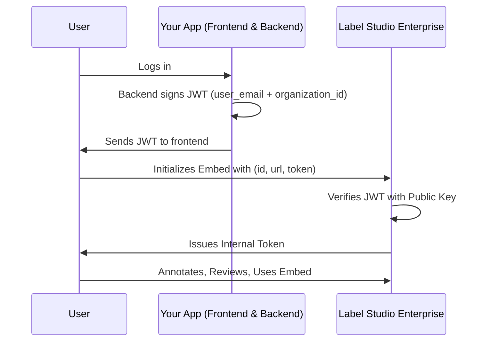

Label Studio Embeds allow you to seamlessly integrate annotation and review functionality into your own applications. 

!!! note
    This feature is not available to all customers. Contact your [HumanSignal account manager](mailto:sales@humansignal.com) to enable.

Before you begin, ensure you have:
* Label Studio:
    * You must have the Owner role in Label Studio.
    * From **Organization > Access Token Settings**, ensure that at least one option is enabled.


* Your external application:
    * Access to your server backend (to generate signed tokens).
    * The URL where your embed will be hosted.


## Authorization

At a high level, the embed process is a secure handshake between your app and Label Studio:

1. A user logs into your external app.

2. Your backend signs a JWT with their `user_email` and `organization_id `using your private key.

3. Your frontend initializes the Label Studio embed with `id`, `url`, and `token`.

4. Label Studio validates the JWT and issues its own internal token.




### Generate a JWT on your server

You must begin by generating a JSON web token (JWT) that authenticates Label Studio. 

You will also need to generate a base64-encoded public URL key, which you will add to Label Studio. 

JWT claims required:

```json
{
  "user_email": "user@example.com",
  "organization_id": "12345",
  "iat": 1692445200,   // (optional) issued-at timestamp
  "exp": 1692452400    // (optional) expiration timestamp
}
```

**Notes:**

* You can find your organization ID from the **Organization** page in Label Studio.   
* The example below uses RS256 as a verification algorithm, but you can find a full list of supported algorithms from **Organization > Usage & Billing > Embedding**.   
* The public key must be stored in Label Studio in base64-url encoded format.


#### Example: Node.js (jsonwebtoken)

```javascript
const jwt = require("jsonwebtoken");
const fs = require("fs");

const privateKey = fs.readFileSync("./private.pem");

const token = jwt.sign(
  {
    user_email: "user@example.com",
    organization_id: "12345",
  },
  privateKey,
  { algorithm: "RS256", expiresIn: "1h" }
);

console.log(token);
```

## Configure embedding in Label Studio

From Label Studio, go to **Organization > Usage & Billing > Embedding** and complete the following fields:

| Field | Description  |
| :---- | :---- |
| **Supported domains** | List the domains of your external application where you will be adding an embedding.  |
| **Public Verification Key** | This must be a base64-url encoded key.  |
| **Public Verification Algorithms** | The algorithm you used when creating your key.  |
| **Embed SDK** | Add this to your application to initialize the embedding.   |

## Configure an embedding page in your external application

At a minimum, you need to add the **Embed SDK** script to an HTML page in your application. For example:

```xml 
<script src="https://app.humansignal.com/react-app/embed-sdk.js"></script>
```

But to maximize the usability of your embedding, you can also include additional Label Studio elements. See our [Frontend Reference](frontend_reference). 

Here is an example:

```xml
<html>
	<body>
		<!-- Outlet of Embed -->
		<label-studio-embed id="embed-1"></label-studio-embed>
		
		<!-- Inclusion of EmbedSDK script -->
		<script src="https://app.humansignal.com/react-app/embed-sdk.js"></script>
		
		<!-- Implementation Example -->
		<script>
				// Initialize the Label Studio Embed SDK 
        const sdk = LabelStudioEmbedSDK.create({
	        id: "embed-1", // targets the id of the `label-studio-embed` WebComponent that serves as the outlet of the embed
	        url: "https://app.humansignal.com", // url of the target LabelStudioEnterprise instance
	        token: "<signed-jwt-of-current-user>", // Signed JWT using private key of the paired public verify key configured in organization settings with following structure: {"user_email": "targetuser@email.com", "organization_id": <yourlseorg_id:int>}
	        mode: "label" // Loaded tasks and annotations for the user will be presented with a preconfigured interface for the purpose of labeling
        });

				// Listen for ready events (this fires once after all of the embed is loaded with a given task)
        sdk.on('ready', () => {
            console.log('LSE Embed - SDK ready for task');
        });

				// Listen for error events
        sdk.on('error', (error) => {
            console.error('LSE Embed - SDK error:', error);
        });
        
        // Listen for task load events
        sdk.on('taskLoad', (task) => {
            console.error('LSE Embed - Task load:', task);
        });
        
        // Listen for annotation select (switching/loading annotation) events
        sdk.on('selectAnnotation', (annotation) => {
	        console.error('LSE Embed - Annotation select:', annotation);
        });
        
        // Listen for entity (region/label data) create events
        sdk.on('entityCreate', (entity) => {
            console.log('LSE Embed - Entity create:', entity);
        });
        
        // Listen for entity (region/label data) delete events
        sdk.on('entityDelete', (entity) => {
            console.log('LSE Embed - Entity delete:', entity);
        });
        
        // Listen for annotation submission events
        sdk.on('submitAnnotation', (annotation) => {
            console.log('LSE Embed - Annotation submitted:', annotation);
        });

        // Listen for annotation update events
        sdk.on('updateAnnotation', (annotation) => {
            console.log('LSE Embed - Annotation updated:', annotation);
        });
        
        // Set Options
	      // ex. Load a task by id 1 (This is LSE task id, user in LSE must have access to the task or 403 authorization errors will be thrown)
	      sdk.setOptions({ taskId: 1 }); // Loads the most recent annotation for that given user if available
	      
	      // ex. Select an annotation of a task by id 2 (This is LSE annotation id, user in LSE must have access to the task or 403 authorization errors will be thrown)
	      sdk.setOptions({ taskId: 1, annotationId: 2 }); // Will select and load the annotation if found
	      
	      // ex. Select a prediction of a task by id 3 (This is LSE prediction id, user in LSE must have access to the task or 403 authorization errors will be thrown)
	      sdk.setOptions({ taskId: 1, predictionId: 3 }); // Will select and load the prediction if found
	      
	      // ex. Change colorScheme of embed instance
	      sdk.setOptions({ colorScheme: "dark" }); // "dark", "light" or "auto"
		</script>
	</body>
</html>
```

## Troubleshooting

**Blank/white screen**

* Domain not listed in **Supported Domains** within Label Studio.  
* Misconfigured/missing public verification key  
* Misconfigured/missing public verification algorithms  
* Verification of the external JWT failed to verify one or more of the claims provided (invalid JWT).  
* Active organization of the user was different than specified in the JWT claims.  
* Your org has not enabled legacy API tokens or personal [access tokens](https://docs.humansignal.com/guide/access_tokens) (need at least one). 
* User with the provided `user_email` does not exist on `LabelStudioEnterprise`

**HTTP errors in SDK**

* 403 (permission errors)  
  * User is not a member of the Project  
  * Task was not assigned to a user, but attempted to load  
  * User did not have access to an annotation or prediction, but it attempted to load anyways

* 404  
  * Task was not found

* Other non-HTTP errors that caused a logical problem in the system.