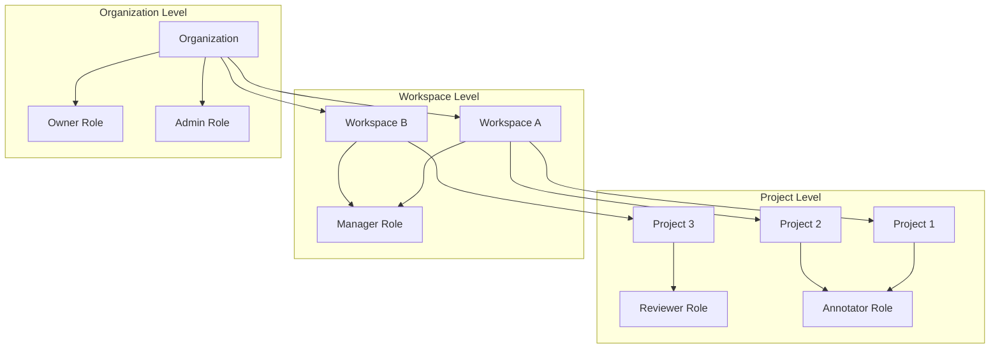

This page provides an overview of the advanced capabilities available exclusively in [Label Studio Enterprise](https://humansignal.com/pricing/). These features extend the core functionality of Label Studio with enterprise-scale user management, security, quality assurance, and automation.

## Organizations and Workspaces

Label Studio Enterprise introduces a hierarchical structure for organizing projects and users through organizations and workspaces, which is not available in the community edition.

### Organizations

Organizations are the top-level entity in Label Studio Enterprise that contain workspaces, projects, and users. Each organization is isolated from others, providing complete data separation.

Key capabilities of organizations:

  - Organization-level user management
  - Isolated data and resources
  - Centralized billing and usage tracking
  - Custom branding options

### Workspaces

Workspaces provide a way to group related projects within an organization. They help structure projects by department, team, or use case.

Key capabilities of workspaces:

  - Group related projects together
  - Delegate management responsibilities
  - Control access at the workspace level
  - Share resources between projects in the same workspace

## Multi-tenant SaaS architecture

Organizations provide complete isolation between different Label Studio Enterprise SaaS customers, ensuring data segregation and independent user management. Workspaces within organizations group related projects by team, department, or product line. Label Studio Enterprise may also be deployed on-prem (see [Enterprise Deployment Options](https://docs.google.com/document/d/18c0DU4LCz5-KoSpYb8xXtAZTphoFtnUY3PTsqCOiohE/edit?ouid=117018906396712310210&tab=t.gclw7dpayxrq)).

## User management and role-based access control

### Role hierarchy and permissions

Label Studio Enterprise implements a comprehensive role-based access control (RBAC) system with five distinct roles, each providing specific capabilities and access levels. For information on how to assign users to roles, see [Manage user accounts.](https://docs.humansignal.com/guide/admin_manage_lse.html)

| Role      | Organization Access | Primary Capabilities                       | Project Management | Annotation | Review | User Management |
| :-------- | :------------------ | :----------------------------------------- | :----------------- | :--------- | :----- | :-------------- |
| Owner     | Full control        | Full system access, billing management     | All projects       | ✅          | ✅      | Full            |
| Admin     | Organization-wide   | User management, all organization settings | All projects       | ✅          | ✅      | Limited         |
| Manager   | Workspace-scoped    | Project creation, workspace management     | Assigned projects  | ✅          | ✅      | Project-level   |
| Reviewer  | Project-scoped      | Review annotations, manage quality control | View only          | ✅          | ✅      | None            |
| Annotator | Project-scoped      | Create and edit annotations                | View only          | ✅          | ❌      | None            |

### Project-level roles

Project roles are assigned independently of organization roles. For example, a user can be an Annotator in one project and a Reviewer in another project, allowing for flexible permission management:

  - **Annotator:** Can view projects and assigned tasks and can create annotations
  - **Reviewer:** Can review annotations, accept or reject them, and provide feedback

### User lifecycle management

Enterprise features include comprehensive user account management capabilities:

  - **Invitation-based signup:** Control user onboarding through invitation links
  - **Bulk user operations:** Assign roles and update workspace memberships in bulk
  - **User activity monitoring:** Track annotation activity and system usage
  - **Account deactivation:** Preserve annotation history while removing access

## Authentication and identity management

Label Studio Enterprise provides comprehensive identity management capabilities for large-scale deployments, supporting integration with existing enterprise identity providers.

### SSO and SAML integration

The enterprise edition supports Single Sign-On through SAML 2.0 assertions, allowing integration with identity providers like Okta, Google SAML, Ping Identity, Microsoft Active Directory, and other SAML-compatible systems. For setup instructions, see the[ Authentication and SSO Configuration Guide](https://docs.humansignal.com/guide/auth_setup).

### SCIM 2.0 provisioning

System for Cross-domain Identity Management (SCIM) 2.0 enables automated user provisioning and deprovisioning from identity providers.

The SCIM integration supports:

  - **Create Users:** Automatic user provisioning with role assignments
  - **Update User Attributes:** Synchronize profile changes and role modifications
  - **Deactivate Users:** Remove access while preserving annotation history
  - **Push Groups:** Workspace and project membership management

For setup instructions, see the [SCIM 2.0 Integration Guide](https://docs.humansignal.com/guide/scim_setup).

### LDAP integration

Enterprise customers can integrate with LDAP directories for user authentication while maintaining local role management.

## Advanced security features

### Enterprise security architecture

Label Studio Enterprise includes comprehensive security features designed for enterprise compliance requirements. Enterprise security features include:

- Redis over TLS with client certificate authentication
- IP allowlisting and VPN access control for cloud storage  
 (OSS supports limited IP filtering only for GCP)
- Advanced audit logging
- SCIM 2.0 user provisioning and deprovisioning
- SAML-based Single Sign-On (SSO) integration
- Role-based access controls across organizations and workspaces
- Granular task and annotator guardrails (e.g. auto-pausing users, setting trust thresholds)
- Custom plugins and front-end customization with organization-level isolation
- Deployment support for fully air-gapped, on-prem environments
- Uptime SLA and security certifications (e.g. SOC 2, HIPAA readiness)

### Data security

  - **End-to-end TLS/SSL:** Secure communication between all components
  - **Audit Logging:** Comprehensive logging of all user activities

### Advanced cloud storage options 

Label Studio Enterprise supports a wider range of persistent storage options for scalable, production-grade deployments. These include:

* **AWS S3 IAM role access**: Configure secure access using IAM roles or static credentials
* **Google Cloud Storage with Workload Identity Federation (WIF)**: Use short-lived credentials to avoid hardcoded secrets

## Advanced labeling & evaluation workflows

### AI features and model integration

Label Studio Enterprise provides enhanced machine learning capabilities:

  - **AI Features Toggle:** Enable AI helper tools
  - **Prediction Score Display:** View prediction/confidence scores in the labeling interface
  - **Bulk Labeling:** Quickly label multiple tasks at once

### Automated active learning loops

Label Studio Enterprise supports active learning workflows that automatically update model predictions as labeling progresses.

After each annotation, Label Studio can send a webhook to a connected machine learning backend. The backend uses the new data to retrain the model `(fit())`, and Label Studio fetches updated predictions `(predict())` for the next task, creating a continuous feedback loop.

Key components:

  - **ML backend setup:** Register a model to receive training data and return predictions
  - **Prediction integration:** Display updated predictions during labeling
  - **Webhooks:** Trigger model retraining after annotations
  - **Task sampling:** Use prediction scores to prioritize which tasks to label
  - **Continuous loop:** As labeling continues, predictions improve with each iteration

### Prompts

For an additional fee, Label Studio Enterprise includes a built-in Prompts interface for working with language models as part of the labeling workflow.

Prompt templates allow users to define inputs, models, and outputs to send to connected LLMs. Prompts can be used to pre-label data, generate new tasks, or support review workflows.

The Prompts interface supports:

  - **Prompt Templates:** Define inputs, outputs, and model parameters
  - **Inline Generation:** Run prompts directly from the labeling interface
  - **Model Connections:** Connect to OpenAI, Anthropic, or custom endpoints via API
  - **Pre-labeling:** Populate fields using model-generated responses
  - **Task Creation:** Generate new tasks from prompt outputs

For more information, see the [Prompts Overview](https://docs.humansignal.com/guide/prompts_overview/).

### Customization with plugins

Label Studio Enterprise supports custom JavaScript plugins to extend and tailor the labeling interface for project-specific needs.

Plugins run automatically when users interact with annotation tasks. They can be used to validate annotations, add visual elements, call external services, or apply custom logic based on events in the labeling UI.

The plugin framework supports:

  - **Project-specific scripts:** Define custom plugins on a per-project basis
  - **Event-driven behavior:** Trigger logic on task load, annotation switch, and other actions
  - **UI extensions:** Add validations, overlays, or context-aware functionality
  - **External integration:** Connect to APIs or fetch reference data in real time
  - **Testing and preview:** Use the built-in panel to test plugins before deployment

To learn how organizations are using plugins in real-world workflows, see the blog post [Build Powerful Labeling Interfaces with Plugins](https://humansignal.com/blog/build-powerful-labeling-interfaces-with-plugins/).

## Quality workflows and analytics

Label Studio Enterprise enhances the annotation workflow with features designed for quality control and team collaboration, as well as analytics to optimize annotation and dataset quality.

### Quality control features

  - **Auto-validation**
  - **Review Workflows:** Configure review processes for annotations
  - **Inter-annotator agreement:** Measure agreement between annotators to ensure quality
  - **Annotator Performance Dashboard:** Track and analyze annotator quality to identity low performers, implement training and corrective actions
  - **Project Performance Dashboard:** View label distribution to ensure completeness
  - **Guardrails for low-trust annotators:** Set limits or pause annotators to prevent

### Inter-annotator agreement metrics and matrices

View real-time agreement metrics to take proactive action on quality. The Enterprise edition includes 30+ built-in agreement metrics for different annotation types, including:

* **Basic matching:** Default evaluation for each control tag type
* **Intersection over Union (IoU):** For bounding boxes and polygons
* **Edit distance algorithms:** For text transcription tasks
* **F1, Precision, Recall:** For classification and detection tasks

To learn how different team structures use agreement metrics to scale high-quality labeling, see the blog post [3 Annotation Team Playbooks for Scalable Labeling](https://labelstud.io/blog/the-spectrum-of-annotators-how-to-match-your-labeling-workflow-to-your-team/).

### Low-trust annotator guardrails

  * **Annotator pausing:** Manual and automatic pausing based on performance criteria
  * **Annotation limits:** Configure maximum annotations per user to prevent spam
 
### Project performance dashboards

The [project dashboard](https://docs.humansignal.com/guide/dashboard_project) provides a high-level view of project status over time, including metrics like tasks completed, annotations submitted, reviews performed, label distribution, and lead times. Users can filter by date ranges and reorder visualizations to focus on key indicators.

### Annotator performance dashboards

Organization owners and administrators can view individual [annotator dashboards](https://docs.humansignal.com/guide/dashboard_annotator) to analyze task counts, average annotation times, review turnaround, and performance scoring. These dashboards help in managing resources, identifying top performers, and tracking quality without building custom analytics tools.

## Project Management

Label Studio Enterprise includes advanced project configuration options to support complex workflows across teams and workspaces.

### Enterprise-Only Project Settings

| Setting Category       | Option                                                                                                                                                                                        | Open Source | Enterprise |
| :--------------------- | :-------------------------------------------------------------------------------------------------------------------------------------------------------------------------------------------- | :---------- | :--------- |
| **General**            | **Project Name, Description, Color**                                                                                                                                                          | ✅           | ✅          |
|                        | **Workspace**                                                                                                                                                                                 | ❌           | ✅          |
|                        | **Proxy Credentials**                                                                                                                                                                         | ❌           | ✅          |
| **Labeling interface** | **Labeling configuration (XML tags)**                                                                                                                                                         | ✅           | ✅          |
| **Annotation**         | **Labeling Instructions (“Show before labeling”)**                                                                                                                                            | ✅           | ✅          |
|                        | **Distribute Labeling Tasks (Auto vs. Manual)**                                                                                                                                               | ❌           | ✅          |
|                        | **Task Reservation**                                                                                                                                                                          | ❌           | ✅          |
|                        | **Skip Queue behavior (Requeue, Ignore, etc.)**                                                                                                                                               | ❌           | ✅          |
|                        | **Annotating Options**  • **Show Skip button**  • **Allow empty annotations**  • **Reveal pre-annotations interactively**  • **Require skip comments** • **Show Data Manager to annotators** | ❌           | ✅          |
| **Live Predictions**   | **Pre-label tasks via connected ML backend or Prompts**                                                                                                                                       | ✅           | ✅          |
| **Task Sampling**      | **Sequential, Uniform, Uncertainty Sampling**                                                                                                                                                 | ❌           | ✅          |
| **Review**             | **Review stream settings:**  • **Instructions**  • **Reviewing Options**  • **Reject Options**  • **Data Manager for reviewers**  • **Agreement column visibility**                          | ❌           | ✅          |
| **Quality**            | **Overlap of Annotations**                                                                                                                                                                    | ❌           | ✅          |
|                        | **Annotation Limit (per-user caps)**                                                                                                                                                          | ❌           | ✅          |
|                        | **Annotator Evaluation (ground-truth scoring & auto-pause)**                                                                                                                                  | ❌           | ✅          |
|                        | **Task Agreement (metric, low-agreement strategy)**                                                                                                                                           | ❌           | ✅          |
|                        | **Custom label weights**                                                                                                                                                                      | ❌           | ✅          |
| **Members**            | **Project-level roles (Annotator/Reviewer per project)**                                                                                                                                      | ❌           | ✅          |
|                        | **Manage Members (add/remove users, assign project roles)**                                                                                                                                   | ❌           | ✅          |
| **Model**              | **Connect ML backends (fit on submit, interactive pre-annotations)**                                                                                                                          | ✅           | ✅          |
| **Predictions**        | **View/import pre-annotations**                                                                                                                                                               | ✅           | ✅          |
| **Cloud storage**      | **Source/Target connectors (S3, GCS, Azure, local)**                                                                                                                                          | ✅           | ✅          |
| **Webhooks**           | **Configure task/annotation webhooks**                                                                                                                                                        | ✅           | ✅          |
| **Danger Zone**        | **Delete Project, Drop All Tabs**                                                                                                                                                             | ✅           | ✅          |
|                        | **Reset Cache**                                                                                                                                                                               | ❌           | ✅          |

For details, view the [Enterprise Project Settings](https://docs.humansignal.com/guide/project_settings_lse).

## Annotation workflow features

### Bulk labeling

Label Studio Enterprise makes it easy to apply the same annotation to multiple tasks at once, ideal for quickly labeling filtered subsets or consistent repetitive data.

Key features:

* **Supports all major data types:** Works with images, text, audio, and video

* **Choose tasks in Data Manager:** Select multiple tasks via list or grid view, then apply bulk labeling

* **Role-based access:** Available to users with Reviewer, Manager, Admin, or Owner roles (Annotators can participate via plugins)

* **Supported control tags:** Choices, DateTime, Number, Rating, Taxonomy, TextArea

### Auto distribution
Label Studio Enterprise supports automated task assignment workflows—helping teams start labeling without manual setup.

When you enable **Auto distribution** under Annotation settings, these project behaviors apply:

* **Immediate task access:** Annotators can begin labeling as soon as the project is published
* **Configurable task overlap:** Use "Annotations per task minimum" to define how many annotators must label each task
* **Task reservation (lock timeout):** Define how long a task remains locked for an annotator before becoming available again
* **Skip queue behavior:** Choose whether skipped tasks should be requeued to others, ignored, or skipped until reassignable

These settings streamline labeling for large teams and support active learning workflows by routing tasks automatically and handling retries when tasks are skipped.

### Annotation results filtering

Label Studio Enterprise enhances task review and management with flexible filtering and sorting options in the Data Manager.

Key capabilities:
* **Field-level filtering:** Filter tasks by annotation outcomes, label values, region attributes, or reviewer actions
* **Task sorting:** Sort tasks by creation date, prediction confidence, or other metadata
* **Combined filters:** Apply multiple filters at once to narrow results for review, QA, or targeted labeling

## Collaboration features

Label Studio Enterprise supports rich collaboration capabilities to enhance communication, review workflows, and performance visibility across teams.

### Comments and notifications

Annotators and reviewers can leave threaded comments linked to specific regions or fields within an annotation, enabling contextual feedback and clarification. All collaborators can view and add comments, with permissions to resolve or delete based on their role. Notifications inform users of new comments, either as the first comment on an annotation or replies to ongoing discussions

### Deep linking

Users can generate direct links to specific annotations, regions, or fields, allowing reviewers or teammates to jump directly to the exact location needing attention. This improves communication efficiency and review precision.

## Enterprise deployment options

Label Studio Enterprise may be deployed on-prem for air-gapped environments. It supports flexible deployment options designed for high availability and scalability.

### Kubernetes deployment

Label Studio Enterprise can be deployed on Kubernetes clusters with advanced configuration options:

### Docker Compose deployment

For simpler enterprise deployments, Label Studio Enterprise supports Docker Compose with external PostgreSQL and Redis dependencies. Key configuration elements:

  * **Image repository:** `humansignal/label-studio-enterprise`
  * **License integration:** Volume-mounted license file
  * **Environment variables:** Database connections, Redis configuration, storage settings
  * **Worker queues:** Separate containers for different priority levels

### High availability configuration

Enterprise deployments support high availability configurations:

  * Multiple app replicas for fault tolerance
  * Configurable RQ worker replicas for different queues
  * Resource configuration for optimal performance
  * PostgreSQL and Redis with TLS support and high availability options

## Performance and scalability features

  * Storage Proxies
  * Optimized Database Queries: Improved performance for large projects
  * Scale-Out Architecture: Distribute workload across multiple pods
  * Redis for Background Tasks: Efficient queue system for handling asynchronous operations

## Whitelabeling

For an additional fee, Enterprise customers can customize the appearance of their Label Studio instance:

  * **Custom Branding:** Customize logos, colors, and styles
  * **Custom Domain:** Use your own domain for the Label Studio instance
  * **Login Page Redirects:** Configure custom login page redirects with the LOGIN\_PAGE\_URL variable

## Enterprise support & professional services

Enterprise customers receive:

  * 99.9% Uptime SLA: Production reliability guarantees
  * Premium Technical Support and SLAs: Priority technical support access
  * Customer Success Manager: Dedicated account management
  * Professional Services: Implementation and optimization assistance
  * Labeling Services: On-demand expert labeling services augment core team, fully integrated into the platform with full visibility and governance

See how Label Studio Enterprise can work at your organization and [contact sales](https://humansignal.com/contact-sales/). 