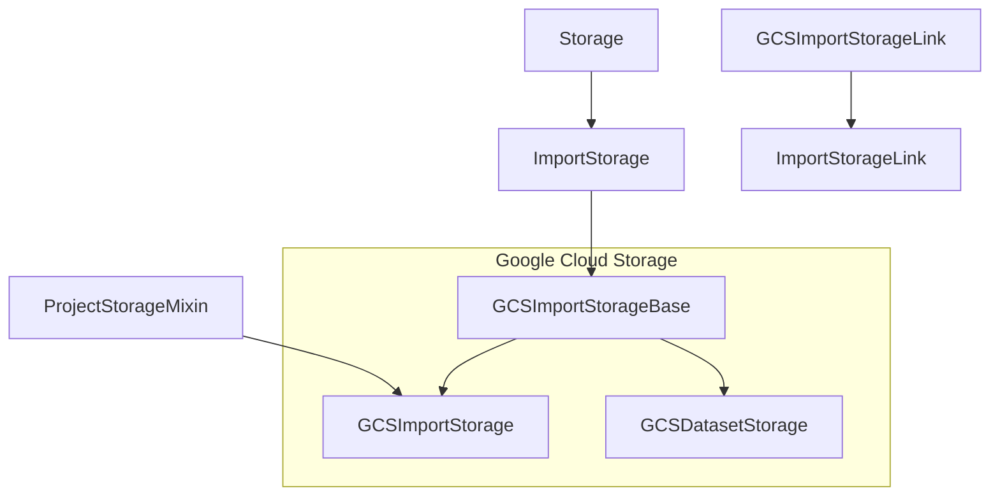
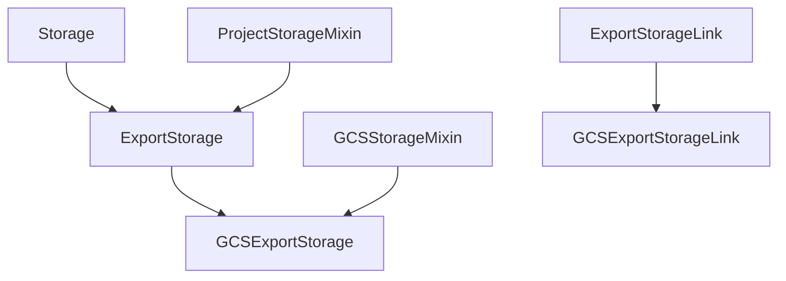
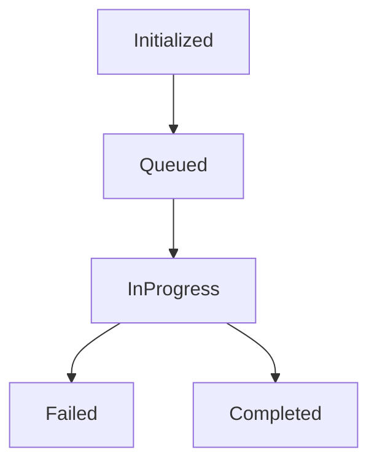

# Cloud Storages

Cloud storage is used for importing tasks and exporting annotations in Label Studio. There are 2 basic types of cloud storages:

1. Import Storages (aka Source Cloud Storages)
2. Export Storages (aka Target Cloud Storages)

Also Label Studio has Persistent storages where LS storage export files, user avatars and UI uploads. Do not confuse `Cloud Storages` and `Persistent Storage`, they have completely different codebase and tasks. Cloud Storages are implemented in `io_storages`, Persistent Storage uses django-storages and it is installed in Django settings environment variables (see `base.py`). 

Note: Dataset Storages were implemented in the enterprise codebase only. They are **deprecated and not used**.

## Basic hierarchy

This section uses GCS storage as an example, and the same logic can be applied to other storages.

### Import Storages
 
This storage type is designed for importing tasks FROM cloud storage to Label Studio. This diagram is based on Google Cloud Storage (GCS), and other storages are implemented in the same way:
  

- **Storage** (`label_studio/io_storages/base_models.py`): Abstract base for all storages. Inherits status/progress from `StorageInfo`. Defines `validate_connection()` contract and common metadata fields.

- **ImportStorage** (`label_studio/io_storages/base_models.py`): Abstract base for source storages. Defines core contracts used by sync and proxy:
  - `iter_objects()`, `iter_keys()` to enumerate objects
  - `get_unified_metadata(obj)` to normalize provider metadata
  - `get_data(key)` to produce `StorageObject`(s) for task creation
  - `generate_http_url(url)` to resolve provider URL -> HTTP URL (presigned or direct)
  - `resolve_uri(...)` and `can_resolve_url(...)` used by the Storage Proxy
  - `scan_and_create_links()` to create `ImportStorageLink`s for tasks

- **ImportStorageLink** (`label_studio/io_storages/base_models.py`): Link model created per-task for imported objects. Fields: `task` (1:1), `key` (external key), `row_group`/`row_index` (parquet/JSONL indices), `object_exists`, timestamps. Helpers: `n_tasks_linked(key, storage)` and `create(task, key, storage, row_index=None, row_group=None)`.

- **ProjectStorageMixin** (`label_studio/io_storages/base_models.py`): Adds `project` FK and permission checks. Used by project-scoped storages (e.g., `GCSImportStorage`).

- **GCSImportStorageBase** (`label_studio/io_storages/gcs/models.py`): GCS-specific import base. Sets `url_scheme='gs'`, implements listing (`iter_objects/iter_keys`), data loading (`get_data`), URL generation (`generate_http_url`), URL resolution checks, and metadata helpers. Reused by both project imports and enterprise datasets.

- **GCSImportStorage** (`label_studio/io_storages/gcs/models.py`): Concrete project-scoped GCS import storage combining `ProjectStorageMixin` + `GCSImportStorageBase`.

- **GCSImportStorageLink** (`label_studio/io_storages/gcs/models.py`): Provider-specific `ImportStorageLink` with `storage` FK to `GCSImportStorage`. Created during sync to associate a task with the original GCS object key.

### Export Storages

This storage type is designed for exporting tasks or annotations FROM Label Studio to cloud storage. 

- **ExportStorage** (`label_studio/io_storages/base_models.py`): Abstract base for target storages. Project-scoped; orchestrates export jobs and progress. Key methods:
  - `save_annotation(annotation)` provider-specific write
  - `save_annotations(queryset)`, `save_all_annotations()`, `save_only_new_annotations()` helpers
  - `sync(save_only_new_annotations=False)` background export via RQ

- **GCSExportStorage** (`label_studio/io_storages/gcs/models.py`): Concrete target storage for GCS. Serializes data via `_get_serialized_data(...)`, computes key via `GCSExportStorageLink.get_key(...)`, uploads to GCS; can auto-export on annotation save when configured.

- **ExportStorageLink** (`label_studio/io_storages/base_models.py`): Base link model connecting exported objects to `Annotation`s. Provides `get_key(annotation)` logic (task-based or annotation-based via FF) and `create(...)` helper.

- **GCSExportStorageLink** (`label_studio/io_storages/gcs/models.py`): Provider-specific link model holding FK to `GCSExportStorage`.

## How validate_connection() works

Run this command with try/except: 
1. Get client
2. Get bucket
3. For source storage only: get any file from specified prefix
4. For target storage: we don't need to check prefix, because it should be created automatically when annotation is written

Target storages use the same validate_connection() function, but without any prefix.

## Key Storage Insights

### 1. **Primary Methods**
- **Import storages**: `iter_objects()`, `get_data()`
- **Export storages**: `save_annotation()`, `save_annotations()`

### 2. **Automatic vs Manual Operation**
- **Import storages**: Require manual sync via API calls or UI
- **Export storages**: Manual sync via API/UI | Manual sync via API/UI and automatic via Django signals when annotations are submitted or updated

### 3. **Connection Validation Differences**
- **Import storages**: Must validate that prefix contains files during `validate_connection()`
- **Export storages**: Only validate bucket access, NOT prefix (prefixes are created automatically)

### 4. **Data Serialization**
Export storages use `_get_serialized_data()` which returns different formats based on feature flags:
- **Default**: Only annotation data (backward compatibility)
- **With `fflag_feat_optic_650_target_storage_task_format_long` or `FUTURE_SAVE_TASK_TO_STORAGE`**: Full task + annotations data instead of annotation per file output. 

### 5. **Built-in Threading**
- Export storages inherit `save_annotations()` with built-in parallel processing
- Uses ThreadPoolExecutor with configurable `max_workers` (default: min(8, cpu_count * 4))
- Includes progress tracking and automatic batch processing

### 6. **Storage Links & Key Generation**
- **Import links**: Track task imports with custom keys
- **Export links**: Track annotation exports with keys based on feature flags:
  - Default: `annotation.id`
  - With feature flag: `task.id` + optional `.json` extension

### 7. **Optional Deletion Support**
- Export storages can implement `delete_annotation()` 
- Controlled by `can_delete_objects` field
- Automatically called when annotations are deleted from Label Studio

## StorageInfo statuses and how they are processed

Storage (Import and Export) have different statuses of synchronization (see `class StorageInfo.Status`):

1. Initialized: storage was added, but never synced; sufficient for starting URI link resolving
2. Queued: sync job is in the queue, but not yet started
3. In progress: sync job is running
4. Failed: sync job stopped, some errors occurred
5. Completed: sync job completed successfully

Additionally, class **StorageInfo** contains counters and debug information that will be displayed in storages:

* last_sync - time of the last successful sync
* last_sync_count - number of objects that were successfully synced
* last_sync_job - rqworker job ID
* status - string with StorageInfo.Status.choices
* traceback - last error traceback
* meta - dictionary with advanced information, including:
  - tasks_existed - pre-existing tasks in the project that will not be synced
  - time_last_ping - the sync process can be lengthy, but it should update time_last_ping every 10 (settings.STORAGE_IN_PROGRESS_TIMER) seconds. When the Storage API tries to fetch the storage, it checks time_last_ping and marks the sync process as failed if there are no updates (see the section "Expected and Unexpected Sync Terminations").

### Expected and unexpected sync terminations

All these states are present in both the open-source and enterprise editions for code compatibility. Status processing can be challenging, especially when the sync process is terminated unexpectedly. Typical situations when this happens include:

1. An exception occurred, it's a soft termination and in this case the sync job has `Failed` status. 
2. OOM error happened => RQ worker job was killed => `storage_background_failure` wasn't called.
3. RQ workers were redeployed => `storage_background_failure` wasn't called.
4. RQ workers were killed manually => `storage_background_failure` wasn't called.
5. Job was removed from RQ Queue => it's not a failure, but we need to update storage status somehow. 

To handle these cases correctly, all these conditions must be checked in ensure_storage_status when the Storage List API is retrieved.

## Storage Proxy API

The Storage Proxy API is a critical component that handles access to files stored in cloud storages (S3, GCS, Azure, etc.). It serves two main purposes:

1. **Security & Access Control**: It acts as a secure gateway to cloud storage resources, enforcing Label Studio's permission model and preventing direct exposure of cloud credentials to the client.

2. **Flexible Content Delivery**: It supports two modes of operation based on the storage configuration:
   - **Redirect Mode** (`presign=True`): Generates pre-signed URLs with temporary access and redirects the client to them. This is efficient as content flows directly from the storage to the client.
   - **Proxy Mode** (`presign=False`): Streams content through the Label Studio server. This provides additional security and is useful when storage providers don't support pre-signed URLs or when administrators want to enforce stricter access control.

### How It Works

1. When tasks contain references to cloud storage URIs (e.g., `s3://bucket/file.jpg`), these are converted to proxy URLs (`/tasks/{task_id}/resolve/?fileuri=base64encodeduri`).

2. When a client requests this URL, the Proxy API:
   - Decodes the URI and locates the appropriate storage connection
   - Validates user permissions for the task/project
   - Either redirects to a pre-signed URL or streams the content directly, based on the storage's `presign` setting

3. The API handles both task-level and project-level resources through dedicated endpoints:
   - `/tasks/<task_id>/resolve/` - for resolving files referenced in tasks
   - `/projects/<project_id>/resolve/` - for resolving project-level resources

This architecture ensures secure, controlled access to cloud storage resources while maintaining flexibility for different deployment scenarios and security requirements.

### Proxy Mode Optimizations*

The Proxy Mode has been optimized with several mechanisms to improve performance, reliability, and resource utilization:

* *Range Header Processing*

The `override_range_header` function processes and intelligently modifies Range headers to limit stream sizes:

- It enforces a maximum size for range requests (controlled by `RESOLVER_PROXY_MAX_RANGE_SIZE`)
- Converts unbounded range requests (`bytes=123456-`) to bounded ones
- Handles various range request formats including header probes (`bytes=0-`)
- Prevents worker exhaustion by chunking large file transfers

* *Time-Limited Streaming*

The `time_limited_chunker` generator provides controlled streaming with timeout protection:

- Stops yielding chunks after a configurable timeout period (`RESOLVER_PROXY_TIMEOUT`)
- Uses buffer-sized chunks (`RESOLVER_PROXY_BUFFER_SIZE`) for efficient memory usage
- Tracks statistics about stream performance and reports on timeouts and print it as debug info
- Properly closes streams to prevent resource leaks

* *Response Header Management*

The `prepare_headers` function manages HTTP response headers for optimal client handling:

- Forwards important headers from storage providers (Content-Length, Content-Range, Last-Modified)
- Enables range requests with Accept-Ranges header
- Implements cache control with configurable TTL (`RESOLVER_PROXY_CACHE_TIMEOUT`)
- Generates ETags based on user permissions to invalidate cache when access changes

### *Environment Variables*

The Storage Proxy API behavior can be configured using the following environment variables:

| Variable | Description | Default |
|----------|-------------|---------|
| `RESOLVER_PROXY_BUFFER_SIZE` | Size in bytes of each chunk when streaming data | 64*1024 |
| `RESOLVER_PROXY_TIMEOUT` | Maximum time in seconds a streaming connection can remain open | 10 |
| `RESOLVER_PROXY_MAX_RANGE_SIZE` | Maximum size in bytes for a single range request | 7*1024*1024 |
| `RESOLVER_PROXY_CACHE_TIMEOUT` | Cache TTL in seconds for proxy responses | 3600 |

These optimizations ensure that the Proxy API remains responsive and resource-efficient, even when handling large files or many concurrent requests.

## Multiple Storages and URL Resolving

There are use cases where multiple storages can/must be used in a single project. This can cause some confusion as to which storage gets used when. Here are some common cases and how to set up mutliple storages properly.

### Case 1 - Tasks Referencing Other Buckets
* bucket-A containing JSON tasks
* bucket-B containing images/text/other data
* Tasks synced from bucket-A have references to data in bucket-B

##### How To Setup
* Add storage 1 for bucket-A
* Add storage 2 for bucket-B (might be same or different credentials than bucket-A)
* Sync storage 1
* All references to data in bucket-B will be resolved using storage 2 automatically

### Case 2 - Buckets with Different Credentials
* bucket-A accessible by credentials 1
* bucket-B accessible by credentials 2

##### How To Setup
* Add storage 1 for bucket-A with credentials 1
* Add storage 2 for bucket-B with credentials 2
* Sync both storages
* The appropriate storage will be used to resolve urls/generate presigned URLs
